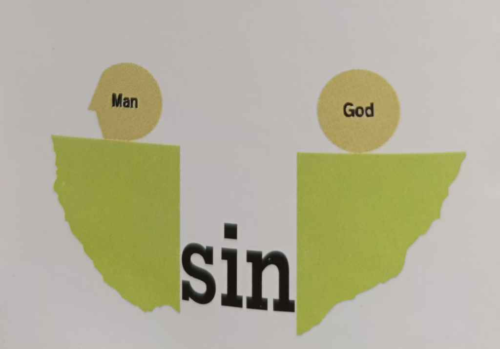

+++
title = "[Draft] Life's Greatest Discovery"
date = 2025-07-03T12:34:35+08:00
draft = true
description = "God had a plan when He designed the universe in which we live. He also had a plan when he designed you."
summary = "God had a plan when He designed the universe in which we live. He also had a plan when he designed you."
tags = ["tracts"]
[reveal_hugo]
  custom_css = "/presentation/lifes-greatest-discovery/custom.css"
+++

*The following presentation is still a work in progress*

---



# Life's Greatest Discovery.

---



God had a plan when He designed the universe in which we live. He also had a plan when he designed you.
The most wonderful experience you can have is to discover and participate in God's plan for your life.

---

## First ...


Life's greatest discovery begins when you realize God loves you, and has a wonderful plan for your life. (A life with meaning and purpose now and in the life to come.)


---

The Bible says, "God loves you."
>For God so loved the world that He gave His only begotten Son, that whosoever believeth in Him should not perish, but have everlasting life.  — John 3:16.

---

God wants you to know His plan for your life.
I am come that they might have life, and that they might have it more abundantly (a life full of meaning and purpose) — John 10:10b.

---

From the Bible you see that God loves you and wants you to enjoy the abundant life.

Why do you suppose most people are not experiencing God's love and enjoying an abundant life?

---

## Second ...



Because . . .

Man is a sinner and sin has separated him from God. God created man His image and gave him an abundant life. He did not make him as a puppet on a string to love and obey Him automatically; but gave him a will and freedom of choice.



---

Man chose to disobey God and go his own self-willed, sinful way. Man is still making this choice today. Everyone of us, you and me included, has chosen to disobey God in many ways . . .

>Your iniquities have separated between you and your God, and your sins have hid His face from you . . .   — Isaiah 59:2.

---
<!-- temporary image. will need scanned copy or svg -->

---

The Bible says that there is not one perfect man.
For there is not a just man upon earth, that doeth good, and sinneth not — Ecclesiastes 7:20.
For all have sinned and come short of the glory of God — Romans 3:23.

---

Sin is missing the mark of perfection, a falling short of God's plan for your life and results in spiritual death.
For the wages of sin is death (separation from God in Hell) — Romans 6:23.

---

Man through the ages has tried to bridge the gap which separates himself from God by doing good works . . . living moral lives . . . devising profound philosophies . . . even being religious. But he has always failed.

---
<!-- TODO add image -->

**There is only one remedy for the problem of sin and separation.**

---

## THIRD . . .

God's remedy for sin is Jesus Christ crucified.

---

When Jesus died on the cross. He paid for our sins and bridged the gap that separates us from God.

For Christ also hath once suffered for sins, the just for the unjust, that He might bring us to God — I Peter 3:18a.

---

Neither is there salvation in any other; for there is none other name under heaven given among men, whereby we must be saved — Acts 4:12.

The Bible says that Jesus died a humiliating, agonizing death. His death paid the penalty for all our sins. But He didn't stay dead. He rose again that we might be right with God. The gap created by our sin has been bridged by Jesus' death and resurrection.

---

He died for our sins.
But God commendeth (proved) His love toward us, in that, while we were yet sinners, Christ died for us — Romans 5:8.

---

He rose from the dead.
That if thou shalt confess with thy mouth the Lord Jesus, and shalt believe in thine heart that God hath raised him from the dead, thou shalt be saved — Romans 10:9.

---

Jesus Christ is the only way to God.
Jesus said unto him, "I am the way, the truth, and the life: no man cometh unto the Father, but by me" — John 14:6.

---

It is not enough to discover that God loves you and has a plan for your life . . . that man is a sinner . . . and Christ is God's remedy for sin . . .

---

## FOURTH . . .

You must receive Christ as your personal Lord and Saviour.

---

It is your decision.

Receiving Christ involves turning over control of your life to Christ.

---

WHO CONTROLS YOUR LIFE?

Here's how you can personally receive Christ.

Trust Jesus and receive Him by personal invitation.

But as many as received Him, to him gave He power to become the sons of God, even to them that believe on His name — John 1:12.

---

For whosoever shall call upon the name of the Lord shall be saved — Romans 10:13.

Behold I stand at the door and knock. If any man hear My voice, and open the door I will come in to him — Revelation 3:20.

---

On which side are you?
On which side would you like to be?

Jesus is seeking entrance into your life at this moment.
Is there any good reason why you cannot receive Jesus Christ right now?

---

(Work in progress)

[Back to Home](/) | [Back to Title](#title)